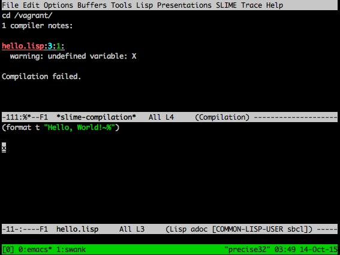
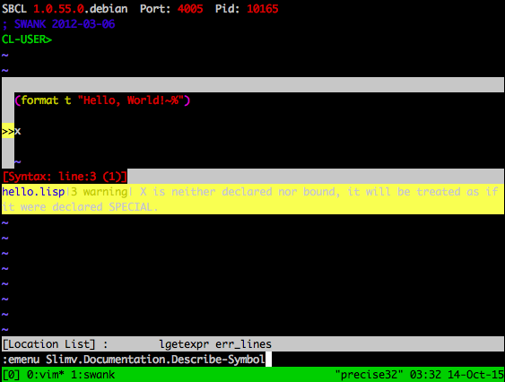

Common Lisp Vagrantfile
======

This is a minimal environment to set up a vagrant box for Common Lisp development.
It includes the following features:
* 32-bit Ubuntu 14.04 Trusty Tahir based
* SBCL
* clisp
* Emacs 24
* Quicklisp
* Slime
* vim 7.3
* slimv
* syntastic
* tmux
* Port 80 forwarded to localhost:8000

To set up, clone the repository and run:

     vagrant up

The new box can be accessed by typing:

     vagrant ssh

The contents of the current directory can be accessed from the virtual machine at `/vagrant`, so you can clone the repository to a new folder and copy your projects there (cleaner) or just throw the files into your project's main directory (less clean).

This project is licensed under the MIT Licence. See LICENCE.txt for the full text.

This project not only installs the [Steel Bank Common Lisp](http://www.sbcl.org/) package, but also installs support for [Read-Eval-Print-Loop](https://en.wikipedia.org/wiki/Read%E2%80%93eval%E2%80%93print_loop) (REPL) integrations and language helpers for both `emacs` and `vim`.

It also installs the [GNU clisp](http://www.clisp.org/) implementation, partly
to support syntax / style checking with the vim [syntastic](https://github.com/scrooloose/syntastic) extension.

Getting started with emacs and slime
----
[Emacs](https://www.gnu.org/software/emacs/) with [slime](https://common-lisp.net/project/slime/) is the dominant IDE used in the Common Lisp world [as of 2015](http://eudoxia.me/article/common-lisp-sotu-2015/).

A step-by-step tutorial is available as part of [this blog by Bill Clementson](https://web.archive.org/web/20130718152035/http://bc.tech.coop/blog/050501.html) that is an extract from [this common lisp music course by Matt Wright and Fernando Lopez-Lezcano](https://web.archive.org/web/20061208063908/http://ccrma.stanford.edu/courses/220b/intro/220b-environment-tutorial.html).  The [slime reference manual is available online](https://common-lisp.net/project/slime/doc/html/index.html#Top).

### emacs and slime for the impatient

Start emacs:

    emacs hello.lisp

Invoke `M-x slime` to start the REPL, and type lisp expressions: 

    (format t "Hello, world!~%")
    (+ 1 2)

Switch back to your editor window:

    C-x b hello.lisp

Add some lisp code, save wih `C-c C-s` and quit with `C-c C-x`.

Getting started with vim and slimv
----
If you would rather use a vi-family editor, don't despair. A port of slime to [vim](http://www.vim.org/) called [slimv](https://github.com/kovisoft/slimv) is available and configured in this image. 

`vim` is configured with a slimv menu that you can get to using tab completion with the `:emenu slimv` command, or by hitting the `F4` key. 

The [slimv tutorial](http://kovisoft.bitbucket.org/tutorial.html) goes into detail about using `slimv` for lisp development.

### vim and slimv for the impatient

Start vim:

    vim hello.lisp

Invoke `:emenu Slimv.Repl.Connect-Server` to start the REPL. Switch to it with `control-w j`, enter insert mode with `i` and type lisp expressions: 

    (format t "Hello, world!~%")
    (+ 1 2)

Switch back to your editor window by typing `esc control-w j`.

Add some lisp code, save wih `:w` and quit with `:q`.

### `vim`, `slimv`, and `tmux` integration
This installation includes `tmux` support primarily to support the `slimv` integration with `swank`, the lisp execution server shared by `slime` and `slimv`.  This [tmux primer](https://danielmiessler.com/study/tmux/) will get you started using tmux, though you do not really need to get into the minutiae just to get `vim` and `slime` to work with `swank`.

The `vim` installation is set up using [Pathogen](https://github.com/tpope/vim-pathogen) and the [vim-sensible](https://github.com/tpope/vim-sensible) and [slimv](https://github.com/kovisoft/slimv) plugins.  Thanks go to [iconoclast and godlygeek on Stack Exchange](http://unix.stackexchange.com/a/57911) for the menu `F4` keybinding suggestion.

Quicklisp package management
====
This setup uses [quicklisp](https://www.quicklisp.org/beta/) for LISP package management. See the instructions in the previous link for instructions on loading packages. The `sbcl` installation in this package already has quicklisp loaded into its init files. 

For example, invoke `sbcl` or start a `slime`/`slimv` REPL within `emacs` or `vim` and issue these statements in order to load the web development framework [clack](http://clacklisp.org/):

    (ql:quickload :clack)

Further Reading
====

* [Practical Common Lisp](http://www.gigamonkeys.com/book/) by Peter Seibel / [buy from amazon](http://www.amazon.com/Practical-Common-Lisp-Peter-Seibel/dp/1590592395)
* [Land of Lisp](http://landoflisp.com/): Learn to Program in Lisp, One Game at a Time! by Conrad Barski / [buy from amazon](http://www.amazon.com/Land-Lisp-Learn-Program-Game/dp/1593272812)
* [Common Lisp the Language](https://www.cs.cmu.edu/Groups/AI/html/cltl/cltl2.html) by Guy Steele / [buy from amazon](http://www.amazon.com/Common-LISP-Language-Second-Edition/dp/1555580416) 
* [Setting up a Vim-based Common Lisp development environment on Ubuntu](http://journal.okal.me/post/75919443198/setting-up-a-vim-based-common-lisp-development)
* [Quickstart: Getting Started with Clojure via Vim, Lein, Slimv (Windows + Linux)](http://adambard.com/blog/quickstart-clojure-on-vim-lein-slimv-windows/)
* [Using Vim for Lisp development](http://stackoverflow.com/questions/94792/using-vim-for-lisp-development)

Panic!
====
If you are stuck in a LISP REPL and need to exit it, you can type:

    (quit)

and the REPL will exit.
    
